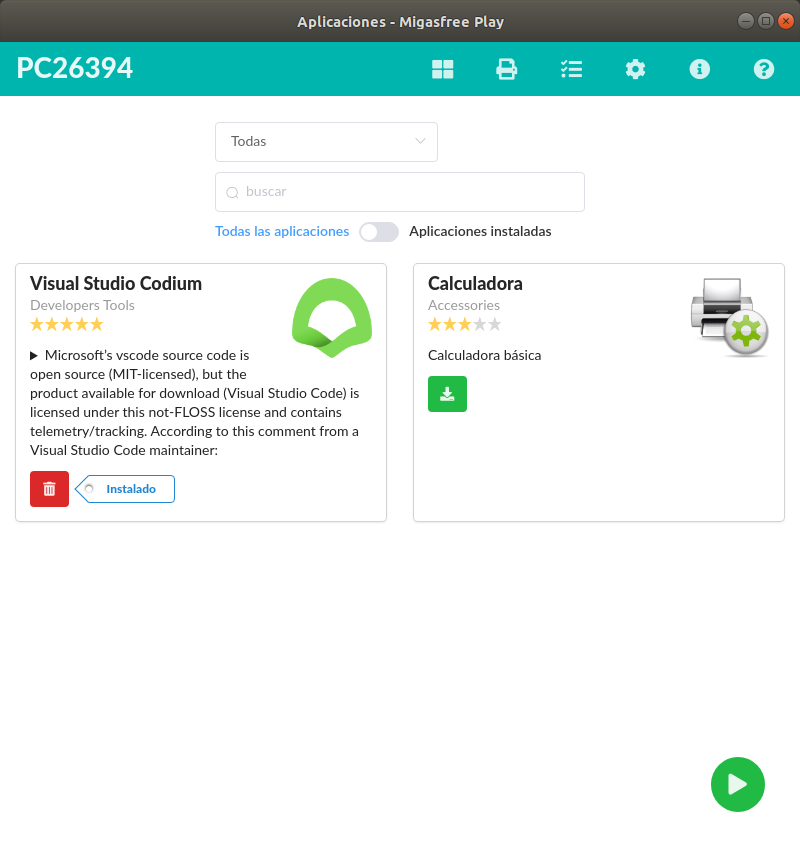
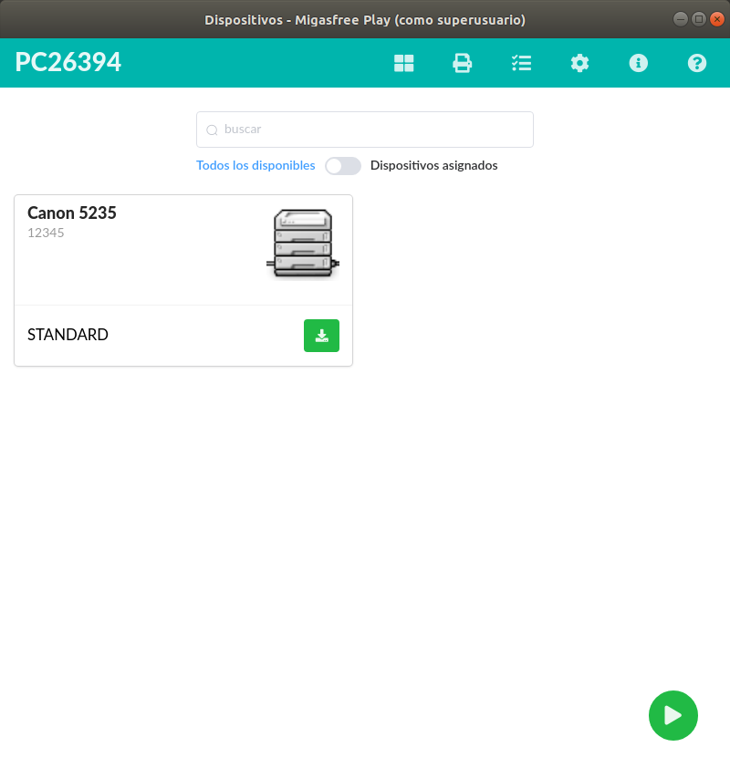
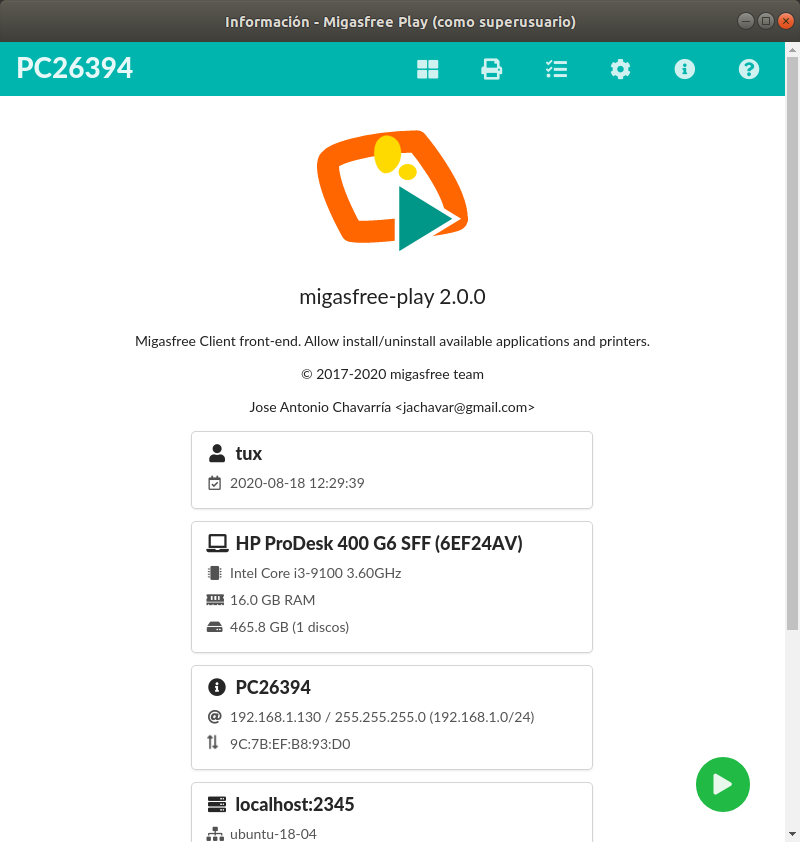

# migasfree-play

> Migasfree Client front-end. Allow install/uninstall available applications and printers.

## Build Setup

```bash
# install dependencies
$ sudo yarn install

# serve with hot reload at localhost:9999
$ sudo yarn dev

# build for production and launch server
$ sudo yarn build
$ sudo electron --no-sandbox .

# after install package
$ sudo migasfree-play --no-sandbox --remote-debugging-port=8315
```

## Requirements

* migasfree-client >= 5.0
* migasfree-backend >= 5.0

## Screenshots






